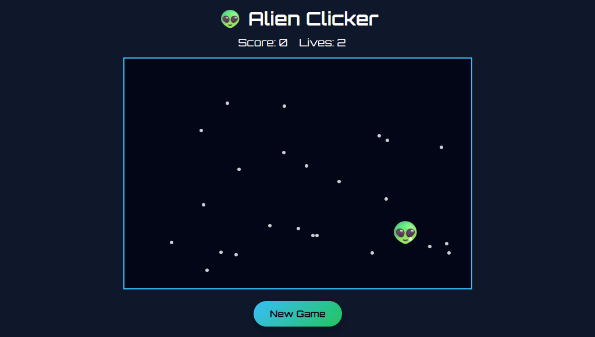

# 👽 Alien Clicker

Alien Clicker is a fun, browser-based clicking game where the player must click on moving aliens while avoiding distractions like stars. The game is responsive and works on both desktop and mobile devices.

---

## 📸Preview



## 🎮 Gameplay

- Click on the alien 👽 as it randomly moves inside the game area.
- Each successful click increases your **score** by 1.
- Missed aliens reduce your **lives** by 1.
- The game ends when you lose all lives.
- Tiny stars appear randomly to make the game more challenging.

---

## ⚡ Features

- **Responsive Design:** Works on desktop and mobile in portrait and landscape mode.
- **Random Alien Movement:** The alien moves to a new random location every 2 seconds (adjusts on mobile).
- **Stars Distractions:** Randomly appearing stars confuse the player.
- **Game Over Animation:** Cute animation plays when lives reach zero.
- **Sound Effects:** Optional explosion sound when alien is clicked.
- **New Game Button:** Reset the game anytime.

---

## 🛠 Installation

1. Clone or download the repository:
   ```bash
   git clone https://github.com/yourusername/alien-clicker.git
   ```

````

2. Open `index.html` in your browser.
3. Play the game!

---

## 📂 File Structure

```
alien-clicker/
│
├─ index.html       # Main HTML file
├─ style.css        # Game styling
├─ script.js        # JavaScript logic
└─ sounds/          # Optional sound effects folder
```

---

## 🔊 Adding Sound Effects

1. Place your sound file (e.g., `explosion.mp3`) inside a `sounds/` folder.
2. In `script.js`, load and play the sound on alien click:

   ```javascript
   const explosionSound = new Audio('sounds/explosion.mp3');

   function hitAlien() {
     wasHit = true;
     score++;
     scoreEl.textContent = score;
     alien.classList.add('hidden');
     explosionSound.play();
   }
   ```

---

## 📝 Notes

- Designed to fit mobile screens in portrait mode.
- Alien movement is constrained inside the game container to prevent it from going outside.
- Stars are purely cosmetic and help increase difficulty.

---

## 🌐 License

This project is for personal use only. All rights reserved by the creator.


````
